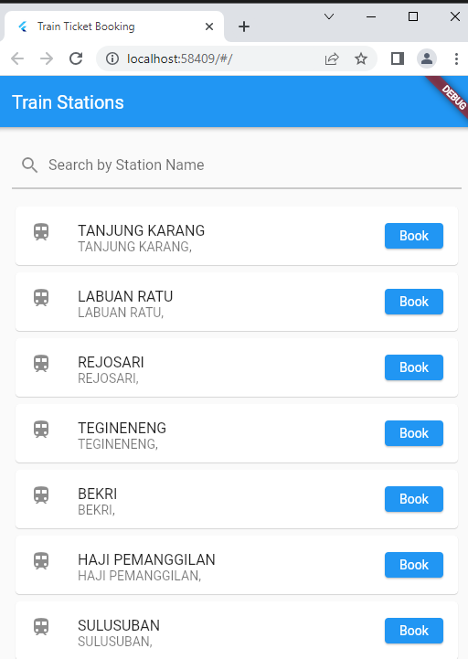

| Herliyansyah          | 312010387             |
|-----------------------|-----------------------|
|  TI.20.A.2            | PEMROGRAMAN MOBILE    |
| UJIAN TENGAH SEMESTER | MENAMPILKAN DATA API  |

## UJIAN AKHIR SEMESTER

## SEMESTER 6

## MENAMPILKAN DATA API

**Disini saya menggunakan data ***API*** dari github ***https://github.com/farizdotid/DAFTAR-API-LOKAL-INDONESIA#informasi-umum*** sementara link source API nya saya akan lampirkan**

**Source Link API :** **https://booking.kai.id/api/stations2** 

**Yaitu Link API ****Daftar Stasiun Kereta Api di Indonesia**** , diatas adalah Source Link API nya**

Disini saya menggunakan *Framework Flutter* untuk membuat aplikasi *Mobile*

Berikut adalah Tampilan dari Aplikasi API  **Daftar Stasiun Kereta Api di Indonesia**

### 1. Halaman Utama Daftar Stasiun Kereta Api

**Diatas adalah contoh tampilan utama atau halaman utama Daftar Stasiun Kereta Api di Indonesia pada halaman utama terdapat banyak stasiun,jika ingin *booking ticket* Klik Book untuk ke halaman berikutnya**

